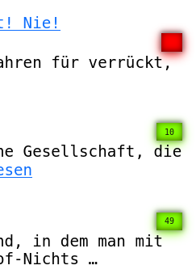

# jekyll privacy counter

[](https://jekyllrb.com/)
[](#)
[](https://www.sqlite.org/)
[](https://joinup.ec.europa.eu/collection/eupl/eupl-text-eupl-12)
[](#)
[](#)

[English translation](README_EN.md)

---
Ein minimalistischer, **datenschutzfreundlicher Besucherzähler** für **Jekyll**,  
ganz ohne Cookies, externe Tracker oder JavaScript-Abhängigkeiten.  
Ideal für statische Blogs, die trotzdem wissen wollen, welche Beiträge gelesen werden.

---

## Intro

Jekyll ist ein Framework welches statische Webseiten ausliefert. Da ich - auch aus Datenschutzgründen - kein Log auf dem Webserver eingeschaltet habe und zudem die eigentlich Webseite noch hinter einer Firewall innerhalb der DMZ steht, habe ich nach einer Lösung gesucht, die mir ganz einfach "zählt", wie oft die entsprechende Webseite aufgerufen wird. Cookies will ich nicht verwenden, JavaScript wollte ich dafür auch nicht. Alle anderen Analyse-Werkzeuge, sind zu groß, zu mächtig und Google und Co. will ich auch nicht zählen lassen. Jedoch interessiert mich schon, ob meine Webseite erfolgreich ist oder nicht.

So ergab sich die hier präsentierte Lösung, das einfach aus dem HTML-Header heraus eine kleine css-Datei ausliefert, die nun für mich den Aufruf der jeweiligen Webseite zählt. Einfach den Titeltext in einer SQLite3 Datenbank eintragen lassen und den Eintrag dann immer um Eins hochzählen lassen.

Das wars.

Jekyll kennt ja im Prinzip 2 verschiedene Modi
 * Development
 * Production

Der Counter wird nur geladen wenn die Produktive Webseite online ist. Ich zeige später, wie man das macht. In der Entwicklungsumgebung wird der Counter nicht geladen, dafür aber die Statistik zu jedem Artikel eingeblendet als auch eine vollständige Statistik-Seite, die alle Zugriffe auf die jeweiligen Seiten anzeigt.

## Start Entwicklungsumgebung

Zuerst in den jeweiligen Ordner wechseln, in dem deine Jekyll Webseite gespeichert ist. Mit dem nachfolgenden Code starest du deine lokale Kopie.

```bash bundle exec jekyll serve --unpublished --drafts --livereload```

Es hängt nun ganz von deiner Konfiguration in der _config.yml ab, auf welchem Port und welcher IP die Testseite gestartet wird. Diese kannst du nun mit deinem Webbrowser aufrufen, und nun nach und nach alle Scripte ergänzen. Die Option --livereload führt dazu, dass jede gespeicherte Veränderung sofort im Webbrowser angezeigt wird.

Die Optionen: --unpublished zeigt alles an, was den Schalter "published: false" im Post-Text hat. Die Option --drafts zeigt alle Dateien an, die im Ordner _drafts liegen. Auch das sind Dateien, die nicht veröffentlicht werden, es sei denn sie werden in den Ordner _posts verschoben.

## Der Einbau

Damit sollte der Bau der Webseite aufgerufen werden. Das ist wichtig, damit Jekyll erkennt, es handelt sich um die Production Webseite.

``` JEKYLL_ENV=production bundle exec jekyll build ```

Damit werden die Variablen innerhalb deiner Templates erkannt und entsprechend umgesetzt:

```



```

Alles was jetzt "ungleich" produktion ist, wird hier includiert. In dem Fall die ``` js-ministat.html ```, welche das Javascript aktiviert, die Datenbank abfragt und dann zur Anzeige bringt.

Wichtig auch hier, dass die Variablen korrekt gesetzt sind, da sonst die Anzeigen auf der Live-Webseite zu sehen sind. Und das wollen wir ja nicht.

```

  
    <span class="mini-led-red views" data-page="{{ post.title | escape }}">&nbsp;</span>
  
    <span class="mini-led-green views" data-page="{{ post.title | escape }}">&nbsp;</span>
  

```

Das war es eigentlich und so sieht das Ergebnis bei mir aus:



Viel Spaß!


### Zusatz: start.sh

Ich arbeite direkt auf dem Webserver, der die anzuzeigende Webseite ausliefert. Meine Entwicklungsumgebung liegt da ebenfalls.  
Eine Verbindung per ssh in meinen persönlichen Ordner, die ./start.sh aufgerufen und schon ist die Testseite da. Und in genau diese Testseite
werden die Statistiken eingefügt und angezeigt.
Beende ich das Script mit CTRL+C, wird abgefragt ob die Änderungen auf der Hauptseite ausgeführt werden sollen oder noch nicht.

Der Eintrag  
``` published: false ```  
im Header der Posts zu jekyll, verhindert bei mir, dass der Post mit veröffentlicht wird. Fehlt der Eintrag oder wird zu "true" geändert, führt das dazu, dass der Post bei der nächsten Veröffentlichung mit angezeigt wird.

Die Konfiguration ist simpel  
SRC = mein Entwicklungsordner  
DEST = die eigentliche Webseite
GIT_REPO = mein interner Backup-Server. Den Part kannst du auch löschen, wenn du so etwas nicht benutzt

Jekyll generiert den Ordner _site, in der die nun fertige Webseite generiert wird. Diesen Ordner liefert mein Webserver automatisch aus. Eine entsprechende Konfiguration deines Webserver vorausgesetzt.

Dieses Script musst du nicht verwenden, um den Counter innerhalb der Webseite zu starten. Es soll lediglich eine Hilfe für dich sein, vielleicht hast du ja auch noch andere Ideen oder Ansprüche. Mir hilft das Script gewaltig, kein kopieren mehr, keine vergessenen Dateien usw. Und ich habe sogar jetzt ein automatisches Backup. ;o)

```bash
SRC="361-grad-lokal/"
DEST="361-grad-webseite/"
GIT_REPO="http://gitlab1.home/micro/361neu"

```